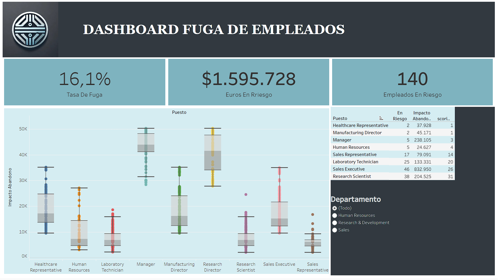

# PROYECTO Modelo En Pronostico De Abandono En Una Empresa

__Análisis Exploratorio del Dataset de abandondo empleados y realizacion de un pronostico de abandono en los empleados__

El objetivo principal del proyecto es reducir la fuga de empleados en la empresa a través de un enfoque basado en datos y Machine Learning. 

En este repocitorio encontraras todos los archivos con los que se trabajo en una carpeta aparte llamada __limpieza de datos__ encontraras un archivo llamado __limpieza_de_datos_eda__ el cual contiene un .ipynb con el codigo comentado de solo la liempieza de datos y el archivo completo con la integracion de Maching Learning esta en el main llamado __Fuga_Empleados_ML__ igualmente todo el archivo esta comentado para su estudio a detalle.

te dejo el enlace al dashboard interactivo realizado en Tableau: <br>

__https://public.tableau.com/views/DasboardFugaDeEmpleados/Dashboard1?:language=es-ES&publish=yes&:sid=&:redirect=auth&:display_count=n&:origin=viz_share_link__


## Tabla de Contenidos

- [Instalación](#instalación)
- [Descripción](#descripción)
- [Dashboard](#DASHBOARD)
- [Contacto](#contacto)


## Instalación

Sigue estos pasos para preparar el entorno y comenzar con el análisis:

1. **Descargar el Archivo de Datos**
   - Descargue el archivo con los datos desde [BD].

2. **Importar los Datos en Power BI**
   - Abra Power BI y cargue el archivo de datos descargado.

3. **Dependencias**
   - Este proyecto utiliza Power BI para el análisis. Si prefiere usar Python, asegúrese de tener las siguientes librerías instaladas:
     - `pandas`
     - `numpy`
     - `matplotlib` 
     - `sklearn.preprocessing`

   Puede instalar estas dependencias usando pip:

   ```bash
   pip install "name"

## Descripción
Objetivos del proyecto
Como te ha explicado el director de Data Science, el gran objetivo del proyecto en el que vas a trabajar es reducir la fuga de empleados de la empresa.

Para ello, durante este proyecto trabajaremos en 3 grandes cosas:

Entender y cuantificar el problema desde el punto de vista de negocio.
Desarrollar un sistema automatizado de Machine Learning que identifique a los empleados que están en mayor riesgo de fuga.
Comunicar los resultados de forma exitosa a la dirección.
Para este proyecto realizaremos 3 componentes clave para el desarrollo del mismo:

Business Analytics

Hemos visto lo que es la calidad de datos y por qué es tan importante.
Hemos hecho un análisis de nulos y corregido los errores.
Hemos realizado análisis exploratorio sobre todas nuestras variables.
Hemos aprendido un par de funciones para hacer EDA que nos permitirán analizar de un plumazo cientos de variables.
Hemos interiorizado un framework súper útil para hacer Business Analytics y presentarlos:
Paso 1: Cuantificación del problema.
Paso 2: Impacto económico.
Paso 3: Escenarios de ahorro.
Machine Learning

He entendido qué es esto de hacer un modelo y para qué sirve.
Hemos visto las diferencias entre las fases de entrenamiento y puesta en producción.
Hemos comprendido la necesidad de dividir los datos en train y test.
Hemos conocido cómo funciona y cómo se interpreta el algoritmo de árbol de decisión.
Hemos entrenado nuestro modelo de Machine Learning.
Gracias a esta parte del proyecto, ya sabemos la principal métrica para evaluar modelos y los valores que indican si un modelo es bueno o malo.
Hemos visto cómo usar el modelo para hacer nuevas predicciones.
Hemos aprendido a leer el diagrama de un árbol de decisión y conocer las variables más relevantes.
Hemos entendido qué hacer con las predicciones y diferentes formas de explotar los resultados.
Productivización

Para este punto, podemos utilizar distintas herramientas de visualización como Power BI, una de las más famosas, pero en esta ocasión lo realizamos en un dashboard en Tableau.

__https://public.tableau.com/views/DasboardFugaDeEmpleados/Dashboard1?:language=es-ES&publish=yes&:sid=&:redirect=auth&:display_count=n&:origin=viz_share_link__



## Contacto

Desarrollador: [Gabriel Rizo](https://github.com/Rizo12G)  
Correo: rizo.tnt@gmail.com
